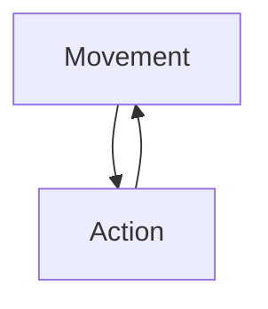

# 动画蓝图
  ## 更新
    - Movement
    - Action
  ## 动画状态机

```mermaid
graph TD
Movement-->Action;
Action-->Movement;
```
  ## 占位符

# Movement
  ## Sprint 倾斜
  

  
  .
  
  **倾斜：**
  
  
  **不倾斜：**
  

</detail>
