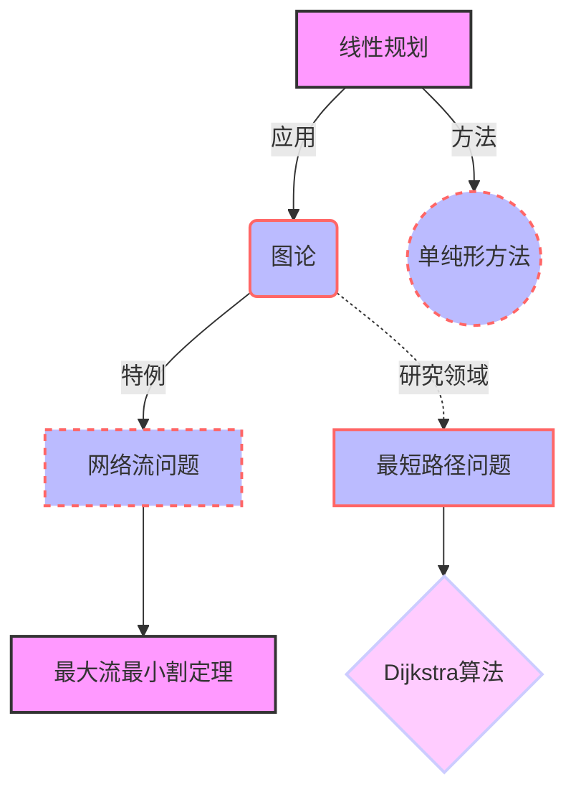

```mermaid
graph TD
    A[线性规划] -->|应用| B(图论)
    B -->|特例| C[网络流问题]
    A -->|方法| D((单纯形方法))
    B -.->|研究领域| E[最短路径问题]
    E --> F{Dijkstra算法}
    C --> G[最大流最小割定理]

    classDef default fill:#f9f,stroke:#333,stroke-width:2px;
    classDef special fill:#bbf,stroke:#f66,stroke-width:2px,stroke-dasharray: 5, 5;
    classDef roundRect fill:#bbf,stroke:#f66,stroke-width:2px;
    classDef diamond fill:#fcf,stroke:#ccf,stroke-width:2px;

    class B,E roundRect;
    class C,D special;
    class F diamond;

```
